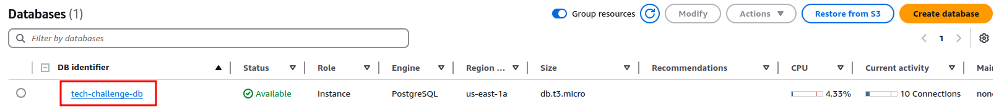

# Tech Challenge - DB

 

## 💻 Descrição

Este repositório é responsável criar o banco de dados no RDS.

## 🛠 Tecnologias Utilizadas

![AWSRDS](https://img.shields.io/badge/AWS%20RDS-312DB2.svg?style=for-the-badge&logo=data:image/svg%2bxml;base64,PHN2ZyB4bWxucz0iaHR0cDovL3d3dy53My5vcmcvMjAwMC9zdmciIHhtbG5zOnhsaW5rPSJodHRwOi8vd3d3LnczLm9yZy8xOTk5L3hsaW5rIiB3aWR0aD0iMzQiIGhlaWdodD0iMzQiIHZpZXdCb3g9IjAgMCAyNCAyNCIgdmVyc2lvbj0iMS4xIj48c2NyaXB0IHhtbG5zPSIiIGlkPSJlcHBpb2NlbWhtbmxiaGpwbGNna29mY2lpZWdvbWNvbiI+PC9zY3JpcHQ+PHNjcmlwdCB4bWxucz0iIj48L3NjcmlwdD48c2NyaXB0IHhtbG5zPSIiPjwvc2NyaXB0PgogICAgPCEtLSBHZW5lcmF0b3I6IFNrZXRjaCA2NCAoOTM1MzcpIC0gaHR0cHM6Ly9za2V0Y2guY29tIC0tPgogICAgPHRpdGxlPkljb24tQXJjaGl0ZWN0dXJlLzE2L0FyY2hfQW1hem9uLVJEU18xNjwvdGl0bGU+CiAgICA8ZGVzYz5DcmVhdGVkIHdpdGggU2tldGNoLjwvZGVzYz4KICAgIDxkZWZzPgogICAgICAgIDxsaW5lYXJHcmFkaWVudCB4MT0iMCUiIHkxPSIxMDAlIiB4Mj0iMTAwJSIgeTI9IjAlIiBpZD0ibGluZWFyR3JhZGllbnQtMSI+CiAgICAgICAgICAgIDxzdG9wIHN0b3AtY29sb3I9IiMyRTI3QUQiIG9mZnNldD0iMCUiPjwvc3RvcD4KICAgICAgICAgICAgPHN0b3Agc3RvcC1jb2xvcj0iIzUyN0ZGRiIgb2Zmc2V0PSIxMDAlIj48L3N0b3A+CiAgICAgICAgPC9saW5lYXJHcmFkaWVudD4KICAgIDwvZGVmcz4KICAgIDxnIGlkPSJJY29uLUFyY2hpdGVjdHVyZS8xNi9BcmNoX0FtYXpvbi1SRFNfMTYiIHN0cm9rZT0ibm9uZSIgc3Ryb2tlLXdpZHRoPSIxIiBmaWxsPSJub25lIiBmaWxsLXJ1bGU9ImV2ZW5vZGQiPgogICAgICAgIDxnIGlkPSJJY29uLUFyY2hpdGVjdHVyZS1CRy8xNi9EYXRhYmFzZSIgZmlsbD0idXJsKCNsaW5lYXJHcmFkaWVudC0xKSI+CiAgICAgICAgICAgIDxyZWN0IGlkPSJSZWN0YW5nbGUiIHg9IjAiIHk9IjAiIHdpZHRoPSIyNCIgaGVpZ2h0PSIyNCI+PC9yZWN0PgogICAgICAgIDwvZz4KICAgICAgICA8cGF0aCBkPSJNNS43MDcsNSBMNy44NTMsNy4xNDYgTDcuMTQ2LDcuODU0IEw1LDUuNzA3IEw1LDcuNSBMNCw3LjUgTDQsNC41IEM0LDQuMjI0IDQuMjI0LDQgNC41LDQgTDcuNSw0IEw3LjUsNSBMNS43MDcsNSBaIE03Ljg1MywxNi44NTQgTDUuNzA3LDE5IEw3LjUsMTkgTDcuNSwyMCBMNC41LDIwIEM0LjIyNCwyMCA0LDE5Ljc3NiA0LDE5LjUgTDQsMTYuNSBMNSwxNi41IEw1LDE4LjI5MyBMNy4xNDYsMTYuMTQ2IEw3Ljg1MywxNi44NTQgWiBNNSwxMiBDNSwxMi43NSA1Ljk2NiwxMy41NDIgNy41MTksMTQuMDY5IEw3LjE5OSwxNS4wMTYgQzUuMTY2LDE0LjMyOCA0LDEzLjIyOCA0LDEyIEM0LDEwLjc3MiA1LjE2Niw5LjY3MiA3LjE5OSw4Ljk4NCBMNy41MTksOS45MzEgQzUuOTY2LDEwLjQ1OCA1LDExLjI1IDUsMTIgTDUsMTIgWiBNMTksMTYuNSBMMjAsMTYuNSBMMjAsMTkuNSBDMjAsMTkuNzc2IDE5Ljc3NiwyMCAxOS41LDIwIEwxNi41LDIwIEwxNi41LDE5IEwxOC4yOTMsMTkgTDE2LjE0NiwxNi44NTQgTDE2Ljg1MywxNi4xNDYgTDE5LDE4LjI5MyBMMTksMTYuNSBaIE0yMCw0LjUgTDIwLDcuNSBMMTksNy41IEwxOSw1LjcwNyBMMTYuODUzLDcuODU0IEwxNi4xNDYsNy4xNDYgTDE4LjI5Myw1IEwxNi41LDUgTDE2LjUsNCBMMTkuNSw0IEMxOS43NzYsNCAyMCw0LjIyNCAyMCw0LjUgTDIwLDQuNSBaIE0yMCwxMiBDMjAsMTMuMjI4IDE4LjgzNCwxNC4zMjggMTYuODAxLDE1LjAxNiBMMTYuNDgsMTQuMDY5IEMxOC4wMzQsMTMuNTQyIDE5LDEyLjc1IDE5LDEyIEMxOSwxMS4yNSAxOC4wMzQsMTAuNDU4IDE2LjQ4LDkuOTMxIEwxNi44MDEsOC45ODQgQzE4LjgzNCw5LjY3MiAyMCwxMC43NzIgMjAsMTIgTDIwLDEyIFogTTEyLDE1LjQwMiBDMTAuODEsMTUuNDAyIDEwLjA4NywxNS4xMDQgMTAsMTUuMDMyIEwxMCwxMC42NTEgQzEwLjU2NCwxMC44ODYgMTEuMjk0LDExIDEyLDExIEMxMi43MDgsMTEgMTMuNDM5LDEwLjg4NiAxNC4wMDQsMTAuNjUgTDE0LjAyLDE0Ljk1MiBDMTMuOTEzLDE1LjEwNCAxMy4xOSwxNS40MDIgMTIsMTUuNDAyIEwxMiwxNS40MDIgWiBNMTIsOSBDMTMuMTc0LDkgMTMuODU4LDkuMzM2IDEzLjk4Nyw5LjUgQzEzLjg1OCw5LjY2NCAxMy4xNzQsMTAgMTIsMTAgQzEwLjc3MSwxMCAxMC4wOCw5LjYzMiAxMCw5LjUzMSBMMTAsOS41MjEgQzEwLjA4LDkuMzY4IDEwLjc3MSw5IDEyLDkgTDEyLDkgWiBNMTIsOCBDMTAuNTU1LDggOSw4LjQ2OSA5LDkuNSBMOSwxNS4wMzIgQzksMTUuOTc5IDEwLjUwNywxNi40MDIgMTIsMTYuNDAyIEMxMy40OTMsMTYuNDAyIDE1LDE1Ljk3OSAxNSwxNS4wMzIgTDE1LDkuNSBDMTUsOC40NjkgMTMuNDQ1LDggMTIsOCBMMTIsOCBaIiBpZD0iQW1hem9uLVJEU19JY29uXzE2X1NxdWlkIiBmaWxsPSIjRkZGRkZGIj48L3BhdGg+CiAgICA8L2c+CjxzY3JpcHQgeG1sbnM9IiI+PC9zY3JpcHQ+PC9zdmc+&logoColor=white)

## ⚙️ Configuração

### Pré-requisitos

1. É necessário executar a pipeline para criar o VPC no repositório: https://github.com/fiap-soat-12/fiap-soat-tech-challenge-vpc
2. É necessário executar a pipeline para criar a imagem no ECR no repositório: https://github.com/fiap-soat-12/fiap-soat-tech-challenge-api

### Desenvolvimento

- **[Kubernetes](https://kubernetes.io/pt-br/docs/home/)**: Documentação oficial do Kubernetes.
- **[Terraform](https://www.terraform.io/)**: Site oficial do Terraform.
- **[AWS](https://aws.amazon.com/pt/)**: Site oficial da AWS.
- **[PostgreSQL](https://www.postgresql.org/docs/)**: Documentação oficial do PostgreSQL.

## 🚀 Execução

### Subindo o DB

  Caso deseje subir o banco no RDS, basta seguir os seguintes passos:
  
  1. Certificar que o Terraform esteja instalado executando o comando `terraform --version`;
  

  2. Certificar que o `aws cli` está instalado e configurado com as credenciais da sua conta AWS;
  

  3. Acessar a pasta `terraform` que contém os arquivos que irão criar a VPC;
  4. Inicializar o Terraform no projeto `terraform init`;
  5. Verificar que o script do Terraform é valido rodando o comando `terraform validate`;
  6. Executar o comando `terraform plan` para executar o planejamento da execução/implementação;
  7. Executar o comando `terraform apply` para criar a infra dentro do cluster;
  8. Após a execução do Terraform finalizar, verificar se o banco subiu corretamente na AWS;
  
