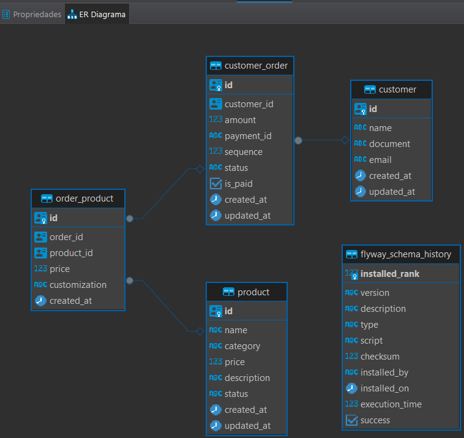

# Tech Challenge - DB

 

## 💻 Descrição

Este repositório é responsável por provisionar e configurar uma instância do **Amazon RDS** na **AWS** com o banco de dados **PostgreSQL**, garantindo a criação e o gerenciamento seguro das configurações relacionadas.

## 🛠 Tecnologias Utilizadas

### 🛠️ Funcionalidades Principais:

- **Provisionamento do RDS**:
  - Criação de uma instância do **Amazon RDS** configurada com **PostgreSQL**.

- **Gerenciamento de Credenciais**:
  - Armazena com segurança o **usuário**, a **senha** e o **nome do banco de dados** no **AWS Secrets Manager**.

- **Armazenamento do Endpoint**:
  - Salva o **endpoint** do RDS (link do banco de dados) no **AWS SSM Parameter Store** para facilitar o acesso seguro.

## Arquitetura

### 🛢️Banco de dados

- **PostgreSQL:**
  - Preferência da comunidade para projetos modernos.
  - Banco de dados open-source que possui licença livre.
  - Consultas SQL complexas e extensíveis.
  - Suporte a índices personalizados e otimizações de desempenho.

### Infraestrutura de banco gerenciado

- **AWS RDS (Relational Database Service):**
  - Configuração gerenciada de instâncias PostgreSQL.
  - Backups automáticos e restauração simplificada.

### Diagrama entidade relacionamento

## ⚙️ Configuração

### Pré-requisitos

1. É necessário executar a pipeline para criar o VPC no repositório: https://github.com/fiap-soat-12/fiap-soat-tech-challenge-vpc
2. É necessário executar a pipeline para criar a imagem no ECR no repositório: https://github.com/fiap-soat-12/fiap-soat-tech-challenge-api

### Desenvolvimento

- **[Terraform](https://www.terraform.io/)**: Site oficial do Terraform.
- **[AWS](https://aws.amazon.com/pt/)**: Site oficial da AWS.
- **[PostgreSQL](https://www.postgresql.org/docs/)**: Documentação oficial do PostgreSQL.

## 🚀 Execução

### Subindo o DB

  Caso deseje subir o banco no RDS, basta seguir os seguintes passos:

  1. Certificar que o Terraform esteja instalado executando o comando `terraform --version`;
  

  2. Certificar que o `aws cli` está instalado e configurado com as credenciais da sua conta AWS;
  

  3. Acessar a pasta `terraform` que contém os arquivos que irão criar o banco de dados;
  4. Inicializar o Terraform no projeto `terraform init`;
  5. Verificar que o script do Terraform é valido rodando o comando `terraform validate`;
  6. Executar o comando `terraform plan` para executar o planejamento da execução/implementação;
  7. Executar o comando `terraform apply` para criar o banco de dados;
  8. Após a execução do Terraform finalizar, verificar se o banco de dados subiu corretamente na AWS;
  
